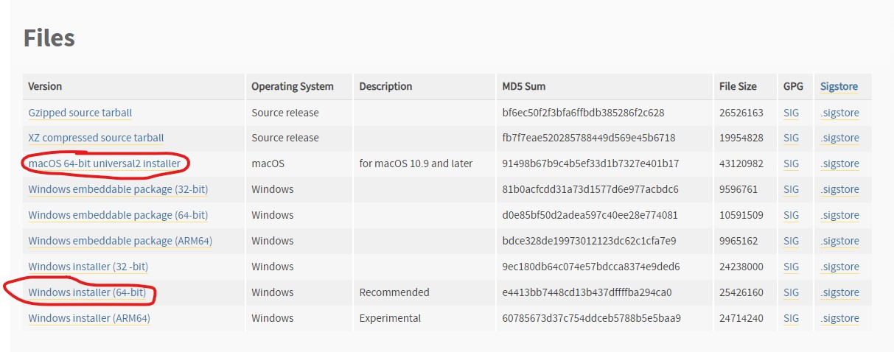
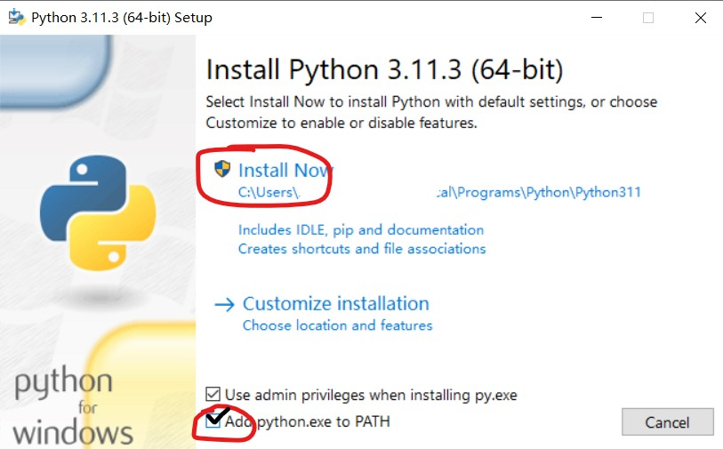
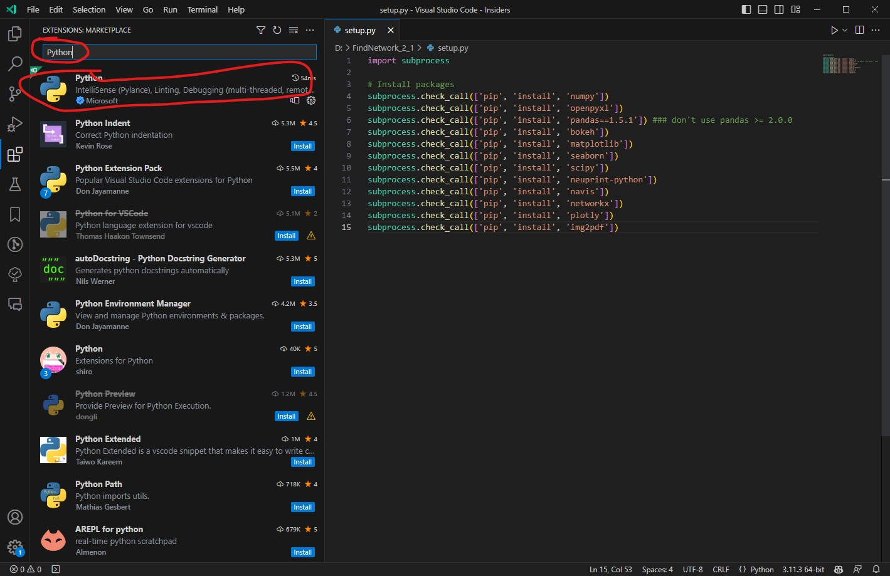
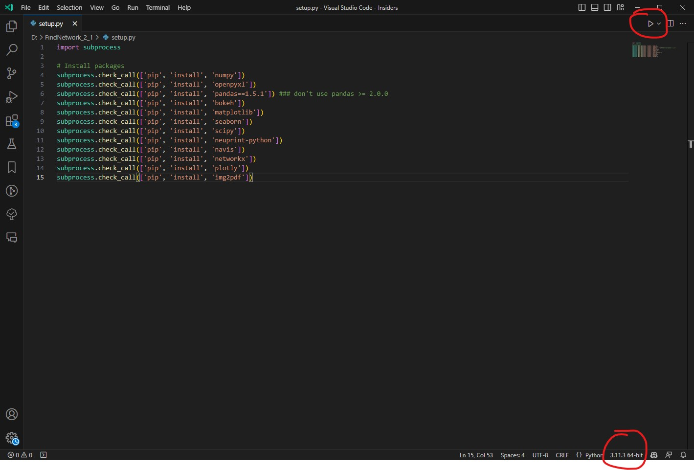
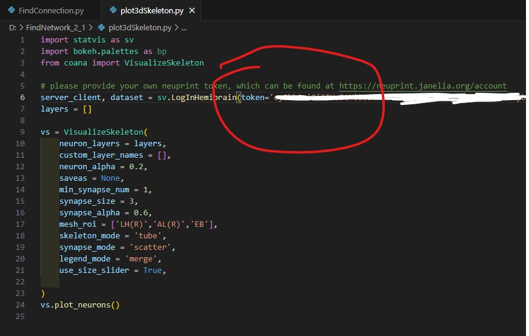
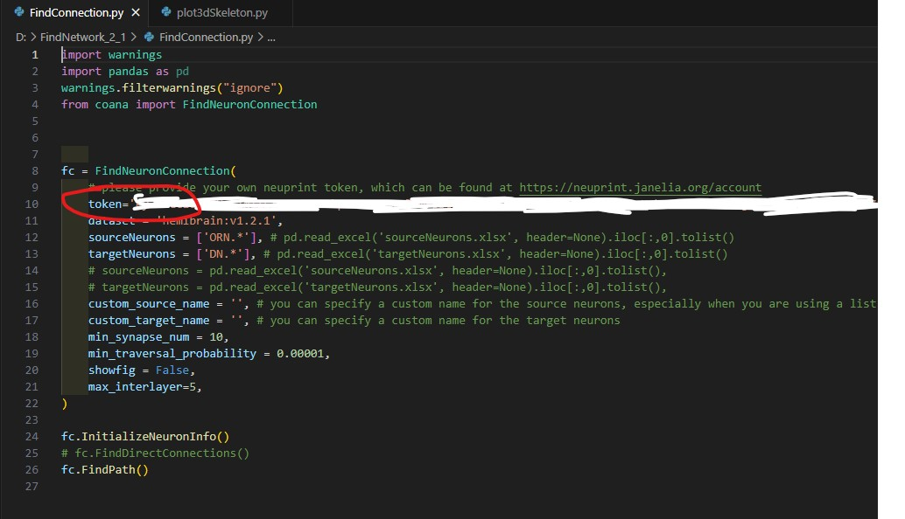
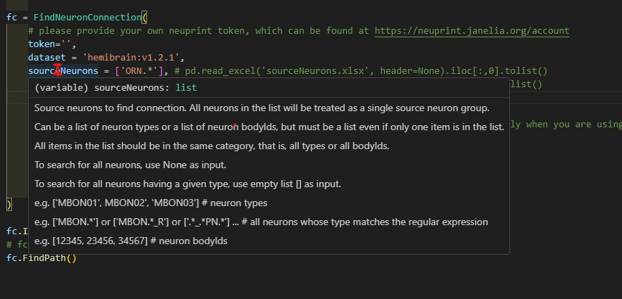

# FindNetwork 2.1

Use these python codes to visit the NeuPrint hemibrain connectomes datasets.

Find direct or indirect connections between neuron clusters and visulize them.
## Basic functions

### FindDirect.py

use this function to find direct connections between neuron clusters

### FindPath.py

use this function to find direct and indirect connection paths between the neuron clusters

### plot3dSkeleton.py

use this function to plot the 3D skeleton of the neuron clusters at different layers, you can also input a single layer to plot the skeleton of all the neurons in that layer.

## Installation: For users who can prepare the python environments by themselves

package requirements are in the setup.py (pandas should be 1.5.1)

## Installation: For users who have troubles with preparing the environments

I. Download python 3.11.3 in [Python Downloads](https://www.python.org/downloads/release/python-3113/). Please scroll down and download the circled installer according to your operating system (MacOS or Windows) and install it. Remember to check the "Add Python 3.11 to PATH" at the bottom of the installer.





II. Download Visual Studio Code (vscode) in [Visual Studio Code](https://code.visualstudio.com/) and install it. Click the "Extensions" button at the left bar to search for "Python" and "VSC-Essentials" and install them, respectively. Then, It's highly recommended to press 'Ctrl + ,' (or click the "manage" button in the bottom left corner and click 'Settings') to open the 'Settings' and search for "Auto Save" and select "OnFocusChange" to automatically save the codes, and search for "Execute In File Dir" and check the box to automatically run the codes in the current file directory.




III. Use vscode to open setup.py, then select the python3.11.3 at the bottom right corner. Click run at the top right corner (red circle in the picture below) to install the requirements. If any error raised, please disconnect the VPN proxy and try again.



IV. Get your own token from [NeuPrint](https://neuprint.janelia.org/account). You should log in with your Google account and found your token in the "Account" page by clicking the "LOGIN" button at the top right corner.

V. Input the token in the downloaded codes, you can specify the token in statvis.LogInHemigrain() or coana.FindConnection() functions, which should be embraced by the quotation marks ('  ') as:

```python
token = 'your_token',
```




VI. You can find the introduction of the functions and their arguments in the codes by move your cursor over the name, e.g.



Now you can run the codes and get the results.
