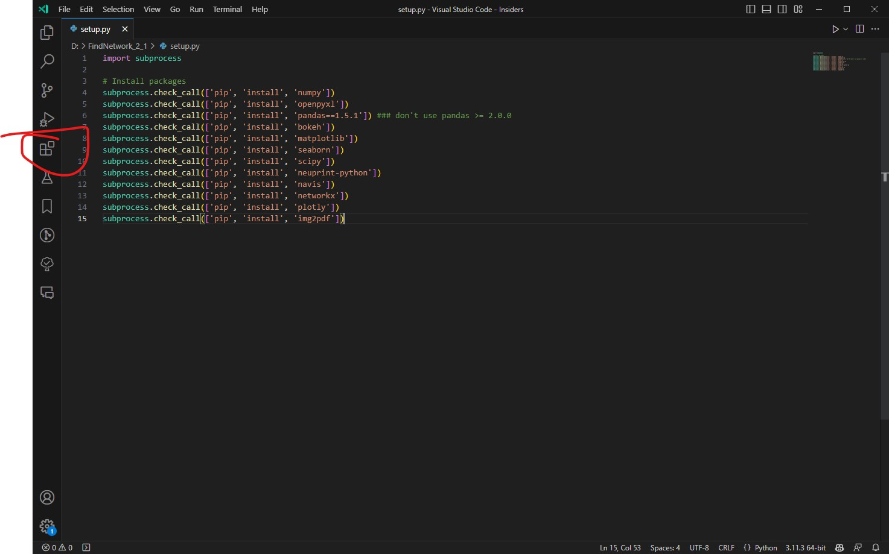

# FindNetwork 2.1

Use these python codes to visit the NeuPrint hemibrain connectomes datasets.

Find direct or indirect connections between neuron clusters and visulize them.

## Set up the python environments

## For users who can prepare the python environments by themselves

package requirements are in the setup.py (pandas should be 1.5.1)

## For users who have troubles with preparing the environments

I. Download python 3.11.3 in [Python Downloads](https://www.python.org/downloads/release/python-3113/). Please scroll down and download the circled installer according to your operating system (MacOS or Windows) and install it. Remember to check the "Add Python 3.11 to PATH" at the bottom of the installer.


II. Download Visual Studio Code (vscode) in [Visual Studio Code](https://code.visualstudio.com/) and install it. Click the "Extensions" button at the left bar to search for "Python" and install it.




III. Use vscode to open setup.py, then select the python3.11.3 at the bottom right corner. Click run at the top right corner (red circle in the picture below) to install the requirements.


IV. Get your own token from [NeuPrint](https://neuprint.janelia.org/account).

V. Input the token in the downloaded codes, you can specify the token in statvis.LogInHemigrain() or coana.FindConnection() functions, which should be embraced by the quotation marks ('  ') as:

```python
token = 'your_token',
```


VI. You can find the introduction of the functions and their arguments in the codes by move your cursor over the name, e.g.


Now you can run the codes and get the results.
