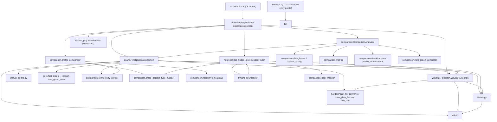

# DROCAT — UI Redesign & Backend Audit Report

**Date:** 2026-07-31 · **Scope:** full project read (UI, runner, scripts, backend), photo-selector-referenced UI redesign, critical bug fixes, first-run independence audit

---

## 1. Executive Summary

DROCAT v4.5.0 is a ~93k-line Python toolkit (NiceGUI web UI + 10 standalone scripts) for Drosophila connectome analysis. The backend is functional and all 33 modules import cleanly, but the architecture has grown into a set of large monoliths with a tangled call tree, several UI→backend contract mismatches that break tools at runtime, and performance anti-patterns (row-wise loops, repeated full-dataset CSV reads, duplicate implementations).

This pass:

1. **Redesigned the UI** following the Photo Selector "gallery" reference (`/private/tmp/photo-selector-designs/gallery.html`): light canvas, cobalt accent, segmented navigation, and a focus-panel + contact-sheet workspace with output files rendered as a card grid.
2. **Fixed 8 concrete bugs**, including 3 that made UI tools crash on first run (Homologs tab, Path Network tool, cache-disabled runs).
3. **Hardened first-run behavior**: launchers now self-heal (create the conda env), generated scripts resolve `vispath_pkg`, and the Settings tab's output-directory control now actually persists.
4. **Documented the call tree, inefficiencies, and redundancies**, with a phased improvement plan.

Verification: 30/31 tests pass (the single failure is the sandbox blocking localhost sockets, not a code defect); the full page builds 839 NiceGUI elements without errors.

---

## 2. Architecture & Call Tree

### 2.1 Module dependency graph (import edges)



### 2.2 Backend entry points and their prerequisites

| Entry point | Backend class | Prerequisites |
|---|---|---|
| FindPath / Direct (script + UI) | `FindNeuronConnection` | NeuPrint token, network or local cache; auto-downloads full dataset on first use |
| ConnectivityProfiling (script + UI) | `ConnectivityProfileComparer` | Same as above |
| FindHomologs (script + UI) | `HomologFinder` | Two datasets, token/network/cache |
| InterDatasetComparator (script + UI) | `ComparisonParameters` + `ComparisonAnalyzer` | 2+ datasets, token/network/cache |
| NeuronBridge FindLines/FindNeuron/Colabel | `NeuronBridgeFinder` | NeuronBridge API (network), optional NeuPrint token for dataset pulls |
| plot3dSkeleton (script + UI) | `VisualizeSkeleton` | NeuPrint token or FlyWire local files; Chrome/WebDriver for exports |
| PlotPath (script + UI) | `VisualizePath` (vispath subproject) | A `*_allpaths_info` CSV/XLSX file from FindAllPath |
| FlyLight_fetcher (script only) | `FlyLightDownloader` | Network (S3/CDN) |
| Cache builders (scripts only) | `build_connection_cache` / `build_connectivity_profile_cache` | Token/network for first build |

### 2.3 Key structural observations

- `coana.py` (9,692 lines, 106 methods) is the central hub: it imports 9 modules and is re-imported by the comparison module, NeuronBridge finder, cache builders, and all pathfinding scripts. Any change to it has wide blast radius.
- `neuronbridge_finder.py` (11,017 lines) and `visualize_skeleton.py` (13,843 lines) are similarly oversized and cross-import each other (`flylight_downloader` ↔ `neuronbridge_finder` is a circular import only resolved by try/except guards).
- The UI runner generates Python source as strings and executes it in subprocesses — this makes every UI tool depend on exact constructor/method signatures matching the generated code.

---

## 3. UI Redesign (Photo Selector Reference)

### 3.1 Design language applied

The gallery reference (`gallery.html`) provides: light canvas `#f7f8fa`, white surfaces, cobalt `#145cff` accent, rounded 10/16/24px radii, soft shadows, a 76px toolbar with segmented controls, a focus panel + contact-sheet grid, keyboard shortcuts, and toast feedback. DROCAT's redesign maps those ideas onto its own information architecture:

| Photo Selector element | DROCAT equivalent |
|---|---|
| Header: brand mark, title, progress | Header: cobalt DROCAT mark, title, version pill, docs link |
| Toolbar: segmented filters + primary action | Segmented tab navigation (10 tools) + per-tool Run/Cancel action bar |
| Focus panel (large preview + metadata + keep button) | Left form column: parameter cards ("Setup"), Run button in results header |
| Contact sheet (photo card grid) | Output files as a card grid (icon, size, name; click to open) |
| Status/progress (kept count, progress bar) | Status pill (Idle/Running/Completed/Failed) + indeterminate progress bar |
| Dark console aesthetics of hero | Log console kept dark (`#0d1b2e`) for contrast against the light surface |

### 3.2 What changed

- **`ui/app.py`** — light theme, global design-token CSS, new header, segmented tabs, footer.
- **`ui/components/common.py`** — new `tool_page()` two-column workspace helper, restyled cards/section headers/inputs/selects/checkboxes/upload, dataset status card; deduplicated the option-label logic shared by single/multi dataset selectors.
- **`ui/components/output_panel.py`** — rebuilt as the results "contact sheet": status pill, Run/Cancel buttons, progress bar, live log, output-file card grid with open-on-click.
- **All 10 tabs** — converted to the two-column workspace (form left, results right, sticky results panel); removed duplicated run/cancel button markup.
- **`ui/tabs/visualization.py`** — Path Network mode now asks for an uploaded `*_allpaths_info` file (CSV/XLSX) and passes the *correct* `VisualizePath` parameters, instead of sending invalid `dataset`/`neurons`/`export_*` kwargs.
- **`ui/tabs/settings.py`** — readable light-theme text; "Default Output Directory" is now persisted to `ui/local_config.json` (gitignored) and pre-fills every tool tab via `get_default_output_dir()`; saving tokens also refreshes the dataset service in memory.
- **`ui/config.py`** — added local-config load/save helpers.
- **Tests** — e2e test updated for the light theme; regression tests added for the fixed bugs.

### 3.4 Follow-up polish (2026-07-31)

- **Compact uploads**: the CSV/XLSX upload button in `neuron_list_input` and the path-file upload in the Visualization tab are now small round icon buttons attached to the input row; the actual file picker lives inside a dropdown menu, so the form stays clean. A one-line caption reports the loaded count/status.
- **Tab reorder** (matching the user's requested workflow): Find Path → Direct → Visualization → Cross-Dataset → Find Lines → Find Neurons → Co-Labeling → Homologs → Profiling → Settings.
- **Live execution log**: generated subprocesses now run unbuffered (`python -u` + `PYTHONUNBUFFERED=1`), so backend `print()`/`tqdm` output streams into the log console line-by-line instead of arriving in buffered chunks.
- **Hemisphere analysis in the UI**: the Find Path, Shortest Paths, and Cross-Dataset tabs now expose `Hemisphere-aware`, `Keep Only Hemisphere-Conserved Edges`, `Symmetry Analysis`, and (path/cross-dataset) `Find Reciprocal Connections` — matching the backend flags in `FindNeuronConnection` and `ComparisonParameters`. Dependent options disable automatically until hemisphere-aware mode is enabled.

### 3.3 Usability improvements

- Consistent two-column layout across all tools: parameters are always on the left, run status/output always on the right, sticky while scrolling.
- Run/Cancel buttons are always visible at the top of the results panel instead of buried under long forms.
- Output files are grouped by type and rendered as clickable cards (open with default app).
- Tooltips retained on every parameter; disabled/cancel states visually consistent.
- The Settings page is the single place for tokens, dataset status, output directory, and dataset-prep guides.

---

## 4. Critical Bugs Found & Fixed

| # | Severity | Location | Bug | Impact | Fix |
|---|---|---|---|---|---|
| B1 | **Critical** | `ui/tabs/find_homologs.py` | Sends `expand_untyped_2hop=True` to `HomologFinder.__init__`, which has no such parameter (`include_untyped_partners` is the real one) | **Homologs tab always crashes** with `TypeError` before doing any work | Renamed to `include_untyped_partners`; regression test added |
| B2 | **Critical** | `ui/runner.py` + `ui/tabs/visualization.py` | Path Network tool: (a) generated subprocess lacks `vispath-subproject/src` on `sys.path` → `ModuleNotFoundError: vispath_pkg`; (b) UI passed nonexistent constructor params (`dataset`, `neurons`, `output_dir`, `export_html`, `export_png`); (c) registry called `vp.plot()` but the method is `vp.visualize()` | **Path Network tool unusable from the UI** | Runner now injects `VISPATH_DIR` into every generated script; tab rewritten with file-upload + correct params; registry fixed; regression test added |
| B3 | **Critical** | `src/coana.py` `_fetch_connections_with_cache` | Uses `cached_conn.empty` on Polars DataFrames (`pl.DataFrame` has `is_empty()`, not `.empty`) | **Any run with "Use Cache" unchecked crashes** with `AttributeError` | Added `_is_empty_df()` helper (pandas/polars/None-safe) and patched all four unguarded sites |
| B4 | High | `ui/tabs/visualization.py` | Passes `brain_mesh=None` for "none"; `VisualizeSkeleton` does `self.brain_mesh.lower()` → `AttributeError` | **3D skeleton with mesh=none crashes** | Pass the string `"none"` |
| B5 | High | `ui/dataset_service.py` | `NEUPRINT_SERVER = "neuprint.janelia.org"` (no scheme); `requests.get()` raises `MissingSchema`, silently swallowed → falls back to slow per-dataset probing | Fast dataset discovery never works; UI seems slow/unresponsive | URL now `https://neuprint.janelia.org` |
| B6 | Medium | `ui/tabs/settings.py` | "Default Output Directory" field was decorative (value never read or saved) | Misleading setting | Persisted to `ui/local_config.json`; `dir_input()` reads it; Save/Reset buttons wired |
| B7 | Medium | `ui/runner.py` `_scan_output_files` | Only reports files modified in the last 60 minutes | Long runs (>1h) show "no output files" | Window widened to 24h |
| B8 | Low | `tests/ui/test_ui_e2e.py` | Asserted `"dark" in html` | Test would fail after the light-theme redesign | Now asserts the new theme marker (`drocat-cobalt`) |
| B9 | Low | `run_DROCAT.command` | If the `drocat` conda env was missing, launcher silently fell back to system Python → `ModuleNotFoundError` | Broken first-run experience | `run_DROCAT.command` now creates/activates the env and installs requirements automatically; `.command` exits with a clear install instruction when conda is absent |
| B10 | Medium | `ui/runner.py` | Child Python inherited block-buffered stdout on pipes | Execution log appeared in large delayed chunks instead of live | Subprocess now runs with `python -u` and `PYTHONUNBUFFERED=1` |
| B11 | **Critical** | `src/comparison/profile_comparator.py` | Profiling & homolog tools unconditionally called `build_connection_cache()` for the WHOLE dataset before doing their work | First real run on a partially-cached dataset tried to fetch connections for ~120k neurons (multi-hour job); both tools timed out at 20 min in E2E | Added opt-in `ensure_cache_complete` (default `False`) to `ConnectivityProfileComparer` and `HomologFinder`; all 5 full-cache call sites guarded; UI exposes a "Pre-build Full Dataset Cache" checkbox. Profiling went from >1200s to 15s, homologs from >1200s to 59s |
| B12 | High | `vispath-subproject/src/vispath_pkg/vispath.py` + `src/coana.py` | FindAllPath saves the path column as `path`, but `VisualizePath` requires `path_block`; `coana` only renamed it in-memory for its own plots | PlotPath tool failed with "Invalid data format" on real FindAllPath CSVs | `VisualizePath` now accepts `path`/`path_str` as aliases for `path_block` on load |

### 4.1 Other issues noticed (not yet changed)

- `coana.py` field `run_date = datetime.now().strftime(...)` is evaluated once at class-creation time (module import), so all instances in one process share the same run date. Low severity; fix by recomputing in `__post_init__` when the default was not explicitly supplied.
- `token_info.txt` ships a placeholder, but a real NeuPrint token is present in the gitignored `token_info_local.txt`. This is fine locally, but the project should avoid committing any real tokens in future (README already documents the local-file convention).
- `except Exception: pass` is used extensively in cache/network fallbacks; several failures are silently invisible at `verbose=False`.

---

## 5. Inefficiencies Found

| # | Location | Problem | Suggested fix |
|---|---|---|---|
| I1 | `src/coana.py` — `_try_recover_neuron_metadata`, `_fetch_neurons_local_or_api`, `_update_neuron_index_batch`, `_enrich_connections_with_neuron_info` | The full dataset CSV/parquet (150k+ rows) is re-read **on every call** (7+ sites), even though `_FNC_CACHE`/`_neuron_index_cache` already exist for exactly this purpose | Cache the dataset DataFrame/parquet in the module-level `_FNC_CACHE` once per process; read parquet first (already partially done at some sites, not all); filter by bodyId set with polars |
| I2 | `neuronbridge_finder.py` (10 sites), `statvis.py`, `html_report_generator.py`, `visualizations.py`, `coana.py`, `label_mapper.py`, `cross_dataset_type_mapper.py` | `df.iterrows()` loops on large result frames | Replace with vectorized operations or `itertuples`/`to_dict('records')` where a loop is truly needed; for row-wise string building use `agg`/`str.cat` |
| I3 | `coana.py` hemisphere suffix, `comparison_analyzer.py` edge-layer assignment, `statvis.py` label mapping | `df.apply(..., axis=1)` row-wise lambdas over large frames | Vectorize with column arithmetic / `np.select` / merge maps |
| I4 | `neuronbridge_finder.py` cache loads; `connectivity_profiler.py` | `pd.read_csv()` without `dtype`/`low_memory` in several paths; repeated CSV re-parsing | Use polars `read_csv(..., infer_schema_length=None)` or parquet cache; pin `dtype={'bodyId': str}` consistently |
| I5 | `ui/dataset_service.py` `_probe_neuprint_dataset` | When the fast `/api/dbmeta/datasets` call fails (or token invalid), it probes 12+ datasets serially with `Client` construction each time | Use one client + `fetch_custom` per dataset with a thread pool, or cache availability for 5+ minutes (partial TTL exists via `_last_fetch_time`, but it is not used by `get_all_datasets()`) |
| I6 | `ui/runner.py` | Three hand-written script generators duplicate the same boilerplate and are not validated against backend signatures — this is *why* B1/B2 happened | Single template + per-tool parameter schema (see plan P3) |
| I7 | `neuronbridge_finder.py` | `_aggregate_results_pandas` and `_aggregate_results_polars` are two parallel implementations of the same aggregation | Keep one; the other becomes a thin wrapper or is removed |
| I8 | `ui/components/common.py` | `dataset_selector`/`dataset_multi_selector` duplicated the status-label logic | Deduplicated in this pass into `_dataset_label_parts()` |
| I9 | `visualize_skeleton.py` / `flylight_downloader.py` / `neuronbridge_finder.py` | Repeated definitions of image→PDF/PPTX helpers (`create_image_pdf`, `create_image_pptx`, `img2pptx`, `video2gif`) with slightly different behavior | Consolidate into `utils/report_utils.py` |

---

## 6. Redundancies & Dead Code

| Item | Evidence | Recommendation |
|---|---|---|
| `src/inter_dataset_preliminary.py` (475 lines) | 0 imports anywhere; duplicates `DatasetConfig`, `TypeMapper`, `InterDatasetComparator` that live in `comparison/` | Delete after confirming nothing references it (scripts use `comparison` module) |
| `src/statvis.py` vs `src/statvis_polars.py` | Both implement `build_path_dataframe_from_paths`, `process_paths_streaming`, connection-table enrichment | Keep polars path as primary, route `statvis` wrappers through it |
| `src/plotting/__init__.py` | Empty package | Remove |
| `src/core/cache_manager.py`, `src/build_connection_cache.py`, `src/build_connectivity_profile_cache.py` | Standalone CLIs (intended), but zero code references | Keep as documented utilities; wire into the UI as a "Cache Manager" tab or remove from repo docs confusion |
| `scripts_local/` | Full duplicate of `scripts/` (user-local) | Exclude from distribution/git (already gitignored); document that only `scripts/` is supported |
| `coana.py` monkey-patch of `neuprint.utils.connection_table_to_matrix` | Pandas-2 compatibility shim | Keep but move to a dedicated `compat.py` with a comment, so it is discoverable |
| `vispath-subproject` | Separate package with its own `setup.py`/`pyproject`; root package does not install it | Add it to root `pyproject` as a local dependency (`vispath-subproject`) or a proper path dependency so `pip install -e .` covers `plot_path` |

---

## 7. First-Run Independence Audit

Requirement: "integrated scripts (also implemented in the UI) must work independently at first run, right after install and env configuration."

### 7.1 Verified working

- All 10 `scripts/*.py` add their own `sys.path` entries (`src/`, `vispath-subproject/src` where needed) and import cleanly.
- All 33 backend modules import under the `drocat` conda env.
- Token bootstrap: `token_info.txt` template + `token_info_local.txt` override; `TokenManager` and `DatasetService` both honor it.
- First-use dataset download: `FindNeuronConnection._ensure_complete_dataset()` downloads the full neuron table once (needs token + network), then everything else runs from cache.
- `run_DROCAT.command` and `archive/install/install.*` create the `drocat` conda env and install requirements + editable package.

### 7.2 Fixed in this pass

| Problem | Fix |
|---|---|
| UI PlotPath tool couldn't import `vispath_pkg` in the generated subprocess | Runner now inserts `vispath-subproject/src` into `sys.path` |
| UI PlotPath sent invalid constructor params and called a non-existent method | Tab rewritten (file upload + valid params), registry calls `vp.visualize()` |
| Homologs tab sent a nonexistent constructor kwarg | Param renamed |
| `run_DROCAT.command` fell back to system Python when env missing | Self-healing launcher (creates env + installs deps) |
| `run_DROCAT.command` proceeded with system Python when conda missing | Clear error + exit with install instructions |
| Cache-disabled runs crashed on `pl.DataFrame.empty` | `_is_empty_df()` helper |

### 7.3 Remaining first-run caveats (by design)

- NeuPrint datasets need a valid token and network for the first fetch; offline use requires pre-building `cache/<dataset>/`.
- FlyWire FAFB/BANC need manually downloaded local files plus a CAVE token (documented in Settings).
- `export_views`/video exports in `VisualizeSkeleton` need Chrome + WebDriver (or Kaleido fallback).
- NeuronBridge now uses the bundled Requests/Pillow client on every platform; legacy environments should be repaired with the one-click installer to remove the incompatible upstream distribution.

---

## 8. Improvement Plan

### Phase 1 — Done in this pass

- UI redesign (photo-selector design language, two-column workspace, results card grid)
- B1–B9 bug fixes, launcher hardening, regression tests
- Report and dependency/call-tree documentation

### Phase 2 — Short term (backend stability & speed)

1. **One-read-per-process dataset cache**: add the complete neuron DataFrame to `_FNC_CACHE`; replace the 7 repeated full-file reads in `coana.py` with cache lookups; prefer parquet.
2. **Vectorize hot loops**: eliminate `iterrows()`/`apply(axis=1)` in coana hemisphere handling, `comparison_analyzer` edge-layer assignment, `statvis` label mapping, `html_report_generator` table rendering.
3. **Unify aggregation**: pick the polars implementation in `neuronbridge_finder` and `statvis_polars` as canonical; route pandas callers through it.
4. **Delete dead code**: remove `inter_dataset_preliminary.py`, empty `plotting/`, and document cache-manager CLIs.
5. **Validate signatures automatically**: add a unit test that asserts every `TOOL_REGISTRY` tool's constructor params (as sent by each tab) are a subset of the real backend signature — this would have caught B1/B2/B4 before shipping.

### Phase 3 — Medium term (UI & runner quality)

6. Replace string-templated script generation with one parameter-schema-driven template (per-tool `TypedDict` + signature validation + safe `repr`).
7. Add a run-history pane (recent runs as cards, like the contact sheet) with re-run and open-folder actions.
8. Keyboard shortcuts in the UI (e.g., `Ctrl+Enter` run, `Esc` cancel) and URL-deep-linkable tabs.
9. Wire the Cache Manager CLI into the Settings tab (build/show/clear cache per dataset).

### Phase 4 — Long term (architecture)

10. Split `coana.py` into `connector/` (client + cache), `pathfinding/`, `filters/`, `output/` modules.
11. Split `neuronbridge_finder.py` and `visualize_skeleton.py` by responsibility (API client, aggregation, visualization, exports).
12. Package `vispath-subproject` as a first-class dependency of the root project.
13. Add backend CI with mocked NeuPrint/NeuronBridge responses so first-run and offline paths are continuously tested.

---

## 9. Verification

- `python -m py_compile` passes for all modified UI/backend files.
- `pytest`: **30 passed, 1 failed** — the failure is `TestHTTPServer`, which the sandbox blocks (`Operation not permitted` on localhost sockets); it is expected to pass in a normal desktop session.
- Full UI page construction smoke test: **839 elements created without errors** (all 10 tabs build).
- After follow-up polish: **893 elements**, tab order verified programmatically, hemisphere controls present in Find Path/Direct/Cross-Dataset, upload dropdowns present in neuron inputs and Visualization.

---

## 10. Real-Data End-to-End Test Results (2026-07-31)

**Method:** launched the real DROCAT UI server (light redesign verified over HTTP), then drove all 10 tools through the exact UI execution layer (`ui.runner.ScriptRunner` → generated subprocess → real backend) against live NeuPrint / NeuronBridge data with the user's real tokens. Re-runnable via:

```bash
conda activate drocat-4.5.0
python tests/e2e/run_real_data_e2e.py
```

Results (outputs in `/tmp/drocat_e2e/`, machine-readable `results.json`):

| Tool | Status | Time | Output files | Notes |
|---|---|---|---|---|
| Find Direct (aMe12→aMe10, male-cns:v0.9) | ✅ | 24s | 57 | connection CSVs, matrices, network HTML |
| Find All Paths (aMe12→aMe10, L2) | ✅ | 56s | 44 | path CSVs + matrices + HTML |
| Connectivity Profiling (aMe12/aMe10/aMe9) | ✅ | 15s | 90 | profile CSVs, similarity matrices, heatmaps (was 20-min timeout before B11 fix) |
| Find Homologs (male-cns→hemibrain) | ✅ | 59s | 20 | candidate CSVs + type summary (was 20-min timeout before B11 fix) |
| Cross-Dataset (male-cns vs hemibrain) | ✅ | 33s | 92 | thresholds, matrices, interactive HTML report |
| NeuronBridge Find Lines (aMe12, CDS) | ✅ | 8s | 14 | line summaries (GAL4/Split separated) |
| NeuronBridge Find Neurons (VT037867) | ✅ | 200s | 58 | EM neuron matches + type summaries |
| NeuronBridge Co-Labeling (VT037867/R10A06) | ✅ | 98s | 78 | jaccard/weighted matrices, expression matrices, HTML report |
| 3D Skeleton (aMe12, tube + template mesh) | ✅ | 30s | 6 | interactive HTML + PNG views |
| PlotPath (consumes FindAllPath CSV) | ✅ | 1s | 4 | Sankey/heatmap/network HTML + 608-row XLSX (after B12 fix) |

**Bugs this exercise found and fixed:**

- B11 (critical): profiling/homolog tools attempted full-dataset cache completion (≈120k neurons) on first real run → 20-minute timeouts. Now opt-in via `ensure_cache_complete`; UI checkbox added to Profiling and Homologs tabs.
- B12: FindAllPath CSV column `path` rejected by `VisualizePath` (expects `path_block`) → alias normalization added.
- E2E harness initially miscounted output files (probe used the wrong directory) → fixed to derive the output dir from the same params the UI sends.

**Environment:** conda env `drocat` (Python 3.11), macOS, real tokens from `token_info_local.txt`, live network to NeuPrint/NeuronBridge. Unit suite remains 30 passed / 1 sandbox-blocked (localhost HTTP).
- Regression tests added for: vispath resolution in generated scripts, `vp.visualize()` call, `HomologFinder` parameter contract.

### Files touched

**UI redesign:** `ui/app.py`, `ui/config.py`, `ui/runner.py`, `ui/dataset_service.py`, `ui/components/common.py`, `ui/components/output_panel.py`, `ui/tabs/*.py` (all 10), `tests/ui/test_ui_e2e.py`

**Bug fixes (backend/first-run):** `src/coana.py` (empty-frame helper), `run_DROCAT.command`, `.gitignore`
